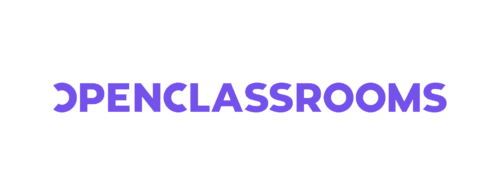

# Munoz Hugo - Développeur Web | Passionné par l'IA 👋

Hello everyone ! Je m'appelle **Hugo Munoz** et je suis développeur FullStack. Je vise à intégrer prochainement **OpenClassrooms** pour suivre leur cursus FullStack, une formation axée sur l'apprentissage par la pratique, la réalisation de projets métier concrets et l'autonomie.

  

👉 **Objectif Formation**

Je projette de suivre la formation **Développeur FullStack** (cursus en 24 mois, dont 14 mois en alternance). Bien que polyvalent sur l'ensemble de la stack, j'ai une **forte préférence pour le Back-End** (architecture API, bases de données, gestion de la logique métier et sécurité).

Ce cursus me permet d'asseoir mes compétences autour de :
- **Conception & Architecture Back-End** : Node.js, Express.js, PHP, Laravel, gestion et optimisation des bases de données (SQL & NoSQL)
- **Développement Frontend** : Intégration et création d'interfaces dynamiques en React.js
- **Clean code** et respect des standards industriels
- **Résolution de problèmes complexes** et conception de solutions techniques adaptées
- **Gestion de projets** en méthodologies agiles

Je suis activement à la recherche d'une **alternance de 14 mois** pour mettre en pratique mes compétences back-end et fullstack au sein d'une équipe technique exigeante.

---

## 🛠️ Mes compétences techniques

Voici un aperçu des technologies maîtrisées lors de mes projets personnels et de ma pratique quotidienne :

### 🥞 Stack Principale

### ⚙️ Backend & Bases de données (Spécialité)

### 🎨 Frontend

### 🛠️ Outils & Environnement

---

## 🎓 Pourquoi viser OpenClassrooms ?

Mon choix de rejoindre **OpenClassrooms** repose sur leur modèle axé sur la réalité du terrain :

- **Pédagogie par projets** : Valider des compétences sur des cas réels et complexes du monde professionnel.
- **Autonomie & Rigueur** : Capacité à mener des recherches poussées, architecturer des solutions et résoudre des bugs de manière indépendante.
- **Mentorat individuel** : Suivi hebdomadaire par des experts du secteur pour assurer la qualité du code produit.

---

## 🚀 À la recherche d'une alternance (14 mois)

Je recherche activement une **alternance de 14 mois** pour accompagner mon entrée en formation et apporter une réelle valeur ajoutée à une équipe technique.

### Ce que j'apporte :

- **Solide affinité Back-End** : Traitement de données, conception d'API robustes, modélisation de bases de données et optimisation serveur.
- **Rigueur et engagement** : Je m'investis pleinement dans chaque projet avec sérieux, logique et détermination.
- **Résolution de problèmes** : Face à un obstacle technique ou un bug complexe, je ne lâche rien tant que le problème n'est pas résolu proprement.
- **Esprit d'équipe** : Communication claire, entraide et écoute active.
- **Veille & IA** : Passionné par l'écosystème web et les outils d'IA pour optimiser les flux de développement.

> 💡 *Je cherche une équipe dynamique où m'investir concrètement sur des problématiques back-end et fullstack tout en continuant d'évoluer.*

---

📫 **Me contacter**
- 🌐 **Portfolio** : [hugomnz.dev](https://hugomnz.dev)
- 📧 **Email** : [hugo.munoz0903@gmail.com](mailto:contact@hugomnz.dev)
- 💼 **LinkedIn** : [linkedin.com/in/hugo-munoz03](https://www.linkedin.com/in/hugo-munoz03/)

---

Merci d'avoir visité mon profil ! N'hésitez pas à me contacter pour échanger sur une opportunité ou un projet.
